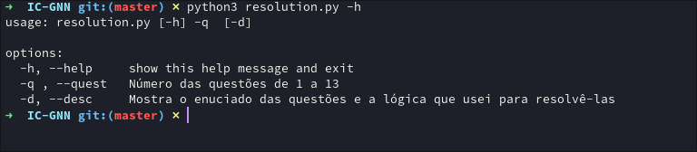
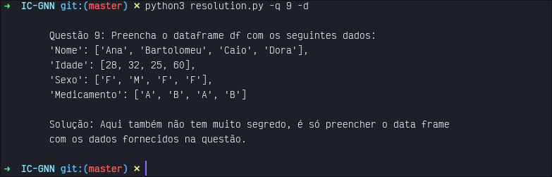
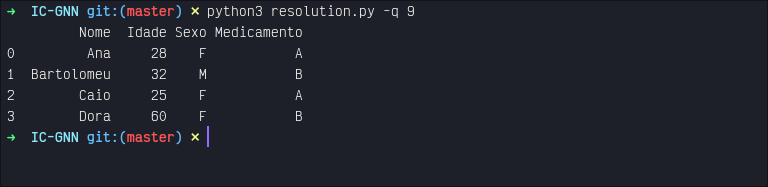

<div align=center>
  <h1>IC-GNN Get started</h1>
  <p>Undergraduate Research Project in Generative Neural Networks.</p>
</div>

## Como instalar ?
Passo 1: Clonar o repositório
```sh
git clonehttps://github.com/rexionmars/IC-GNN.git && cd IC-NN
```
Passo 2: Instalar as dependências<br>
_OBS: lembre-se de ativar o seu ambiente virtual_
```sh
pip install -r requirements.txt
```
## Como rodar o programa?
Este script é uma aplicação `command-line`, logo pode ser fornecido parâmetros em sua chamada, você pode usar parêmetros curtos ou longos. Exemplo: `-h` ou `--help`, ambos
desempenham a mesma função.
Para acessar as opções do programa rode:
```sh
python3 resolution.py -h
```


Exibindo as informações referente a questão desejada, usando o parâmetro opcional `--desc` ou `-d`.<br>
```sh
python3 resolution.py  -d -q NUMERO_DA_QUESTAO_ECOLHIDA
```


Exibindo a solução referente a questão desejada, usando o parâmetro `--quest` ou `-q`.<br>
```sh
python3 resolution.py -q NUMERO_DA_QUESTAO_ECOLHIDA
```

